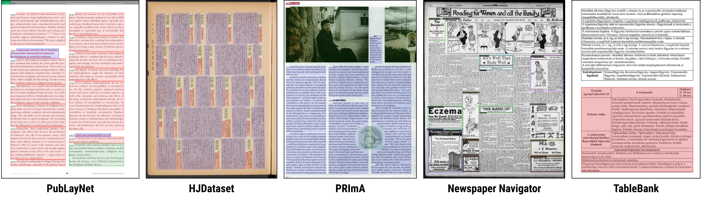

# Information extraction from Image using Deep learning
Research paper and code on information extraction from image/pdf

### INVOICE EXTRACTION
* [PICK Pytorch](https://github.com/wenwenyu/PICK-pytorch)
* [PICK](https://medium.com/analytics-vidhya/extracting-structured-data-from-invoice-96cf5e548e40)
* [Graph net](https://github.com/thisisbhavin/graphicalForest)

### RECEIPT DATA
* [CORD: A Consolidated Receipt Dataset for Post-OCR Parsing](https://github.com/clovaai/cord)

### Datasets
 * [TableBank](https://doc-analysis.github.io/tablebank-page/)
 * [DocBank](https://doc-analysis.github.io/docbank-page/)
 * [FUNSD](https://guillaumejaume.github.io/FUNSD/)
 * [RVL-CDIP](https://www.cs.cmu.edu/~aharley/rvl-cdip/)
 * [SROIE](https://rrc.cvc.uab.es/#)
 * [Document Visual Question Answering](https://rrc.cvc.uab.es/?ch=17&com=introduction)
 * [HTR Dataset ICFHR 2016](https://zenodo.org/record/1297399#.X0zmA9P7TUI)
 * [Tobacco3482](https://lampsrv02.umiacs.umd.edu/projdb/project.php?id=72)
 * [PubLay](https://github.com/ibm-aur-nlp/PubLayNet)
 * [Tobacco800 Complex Document Image Database and Groundtruth](http://tc11.cvc.uab.es/datasets/Tobacco800_1)
 * [NIST Forms](https://www.nist.gov/srd/nist-special-database-2)
 
# DETECT Layout in document/Image:

* [PubLayNet](https://github.com/phamquiluan/PubLayNet)
* [PRIMA](http://primaresearch.org/dataset/)
* [HJDatasets (Historical Japanese Documents with Complex Layouts)](https://dell-research-harvard.github.io/HJDataset/)
* [Newspaper Navigator](https://news-navigator.labs.loc.gov/)
 * [TableBank](https://doc-analysis.github.io/tablebank-page/)
 * [DocBank](https://doc-analysis.github.io/docbank-page/)
#### Tools:
* [layout parsing](https://github.com/Layout-Parser/layout-parser)

### Code:
 * [Layoutlm](https://github.com/microsoft/unilm/tree/master/layoutlm)
 * [Graph Convolution on Structured Documents](https://github.com/dhavalpotdar/Graph-Convolution-on-Structured-Documents)
 * [Graph Matric](https://colab.research.google.com/drive/1CjicFAgc1PtSYBmQKt3OccsOHyf0a5MU#scrollTo=C_Lkp4sqeg8T)
 * [Feature Extraction from Graph](https://colab.research.google.com/drive/1ZkS9YkFgWMR39e9yf5BxcyqPQR4T_hZ1#scrollTo=C_Lkp4sqeg8T)
 * [Extract data from Invoice](https://medium.com/@vigneshgig/how-to-extract-the-structure-of-invoice-data-using-tensorflow-api-faster-crnn-object-detection-8aa15c12bb46)
 * [CascadeTabNet](https://github.com/DevashishPrasad/CascadeTabNet)
 * [Tabulo ](https://github.com/interviewBubble/Tabulo)
 * [PubLayNet](https://github.com/phamquiluan/PubLayNet)
 * [InvoiceNet](https://github.com/naiveHobo/InvoiceNet) Extract text from invoice
 * [Cutie](https://github.com/vsymbol/CUTIE)
 
### Research Papers
 * [LayoutLM](https://arxiv.org/pdf/1912.13318.pdf)
 * [PICK](https://arxiv.org/pdf/2004.07464.pdf)
 * [Deep Convolutional Nets for Document Image Classification and Retrieval](https://www.cs.cmu.edu/~aharley/icdar15/harley_convnet_icdar15.pdf)
 * [Table Detection in Invoice Documents by Graph Neural Network](https://priba.github.io/assets/publi/conf/2019_ICDAR_PRiba.pdf)
 * [Graph Convolution on Structured Documents](https://nanonets.com/blog/information-extraction-graph-convolutional-networks/)
 * [PICK: Processing Key Information Extraction from
Documents using Improved Graph
Learning-Convolutional Networks](https://arxiv.org/pdf/2004.07464.pdf)
 * [Evaluation of Deep Convolutional Nets for Document Image Classification and Retrieval](https://arxiv.org/abs/1502.07058)
 * [Few-Shot Learning with Graph Neural Networks](https://arxiv.org/abs/1711.04043)
 * [MMDetection: Open MMLab Detection Toolbox and Benchmark](https://arxiv.org/abs/1906.07155)
 * [Efficient, Lexicon-Free OCR using Deep Learning
](https://arxiv.org/abs/1906.01969)
 * [An Overview of the Tesseract OCR Engine ](https://static.googleusercontent.com/media/research.google.com/en//pubs/archive/33418.pdf)
 * [Semi-Supervised Classification with Graph Convolutional Networks](https://arxiv.org/abs/1609.02907)
 * [An Invoice Reading System Using a Graph Convolutional Network](https://link.springer.com/chapter/10.1007/978-3-030-21074-8_12)
 * [Spatial Dependency Parsing for Semi-Structured Document Information Extraction](https://arxiv.org/pdf/2005.00642.pdf)
 ### DETECT TABLE in Image/PDF
* [CascadeTabNet: An approach for end to end table detection and structure
recognition from image-based documents](https://arxiv.org/ftp/arxiv/papers/2004/2004.12629.pdf)
* [TableNet: Deep Learning model for end-to-end Table detection and Tabular data extraction from Scanned Document Images](https://arxiv.org/pdf/2001.01469.pdf)
* [RetinaNet](https://medium.com/@djajafer/pdf-table-extraction-with-keras-retinanet-173a13371e89)

## Reference
* [parsing pdf](https://porter.io/github.com/jsfenfen/parsing-prickly-pdfs)

